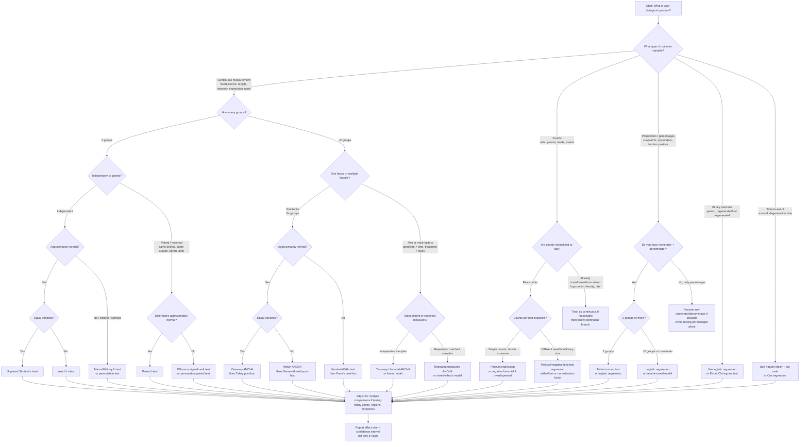

# Biological Data Test Flowchart

Below is a practical **biological-data statistical test decision flowchart**. It is written for typical experiments: qPCR, imaging quantification, cell counts, fluorescence intensity, RNA-seq summaries, survival/regeneration assays, behavior, etc.



## Practical version for biological experiments

### 1. First decide the **experimental unit**

This is the most important step.

Use the independent biological unit as `n`, not the number of images, cells, axons, reads, or ROIs unless those are truly independent.

Examples:

| Measurement | Usually wrong `n` | Usually correct `n` |
|---|---:|---:|
| 500 cells from 3 animals | 500 cells | 3 animals |
| 20 images from 4 retinas | 20 images | 4 retinas |
| 100 axons from 5 cultures | 100 axons | 5 cultures |
| RNA-seq reads | read count | biological replicate |

When many cells or axons are nested inside animals/cultures, use either:

```text
average per animal/culture → test animal-level values
```

or preferably:

```text
mixed-effects model: cells nested within animal/culture
```

---

## Common choices

### Two independent groups

Example: WT vs mutant axon length.

| Data behavior | Test |
|---|---|
| Roughly normal, similar variance | Student’s t-test |
| Roughly normal, unequal variance | Welch’s t-test |
| Clearly non-normal or small n | Mann-Whitney U or permutation test |

In practice, **Welch’s t-test is often safer than Student’s t-test** for biological data because equal variance is rarely guaranteed.

---

### Two paired groups

Example: before/after treatment in the same culture, injured vs contralateral eye from same animal.

| Data behavior | Test |
|---|---|
| Paired differences roughly normal | Paired t-test |
| Paired differences non-normal | Wilcoxon signed-rank test |
| Complex repeated design | Mixed-effects model |

---

### More than two groups

Example: control, injury, injury + drug.

| Data behavior | Test |
|---|---|
| Normal, equal variance | One-way ANOVA + Tukey |
| Normal, unequal variance | Welch ANOVA + Games-Howell |
| Non-normal | Kruskal-Wallis + Dunn’s test |

---

### Two factors

Example:

```text
genotype: WT vs cdKO
time: 0, 1, 3, 7 dpi
```

Use:

```text
two-way ANOVA / linear model
```

Ask specifically whether there is an **interaction**:

```text
Does the effect of genotype depend on time?
```

For repeated measurements or nested data, use:

```text
linear mixed-effects model
```

Example model:

```text
axon_length ~ genotype * time + (1 | animal)
```

---

### Counts

Examples: number of regenerating axons, number of surviving RGCs, number of puncta.

| Situation | Test/model |
|---|---|
| Simple count data | Poisson regression |
| Count data with overdispersion | Negative binomial regression |
| Counts over different areas/time/exposure | Poisson or negative binomial with offset |
| Counts converted to density | Often linear model/ANOVA, but check distribution |

For biological count data, **negative binomial models are often more robust** than Poisson because biological counts are frequently overdispersed.

---

### Proportions or percentages

Example:

```text
45 regenerating axons out of 120 total axons
```

Use the raw numbers whenever possible.

| Situation | Test/model |
|---|---|
| Two groups, small n | Fisher’s exact test |
| Two or more groups | Logistic regression |
| Overdispersed proportions | Beta-binomial model |
| Repeated/nested proportions | Mixed-effects logistic regression |

Avoid testing only percentages if the denominators differ a lot.

For example, these are not equally precise:

```text
50% = 1/2
50% = 500/1000
```

---

### Many genes, proteins, regions, or timepoints

If you test many things, correct for multiple comparisons.

| Situation | Correction |
|---|---|
| Few planned comparisons | Holm correction |
| Many exploratory comparisons | Benjamini-Hochberg FDR |
| RNA-seq / omics | FDR, usually BH-adjusted p-value |

---

## Minimal decision rules I would use in practice

For most biological datasets:

1. **Define the biological replicate correctly.**
2. Plot the raw data.
3. For two independent groups, default to **Welch’s t-test** unless the data are clearly unsuitable.
4. For 3+ groups with unequal variance, use **Welch ANOVA + Games-Howell**.
5. For genotype × treatment/time designs, use a **linear model or two-way ANOVA**.
6. For nested cell/axon/image data, use a **mixed-effects model** or aggregate per animal.
7. For counts/proportions, use **GLMs**: logistic, Poisson, or negative binomial.
8. Always report **effect size + confidence interval**, not only significance.

A compact “default” flow for your kind of data would be:

```text
Is the outcome continuous?
    yes → are samples independent?
        yes → 2 groups: Welch t-test
             >2 groups: Welch ANOVA + Games-Howell
             2+ factors: linear model / two-way ANOVA
        no → paired t-test or mixed-effects model

Is the outcome count/proportion?
    count → negative binomial or Poisson model
    proportion → logistic or beta-binomial model

Are cells/images/axons nested inside animals?
    yes → aggregate per animal or use mixed-effects model

Are many tests being done?
    yes → correct p-values, usually FDR or Holm
```